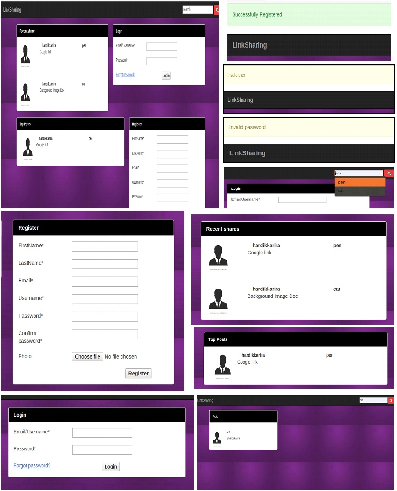
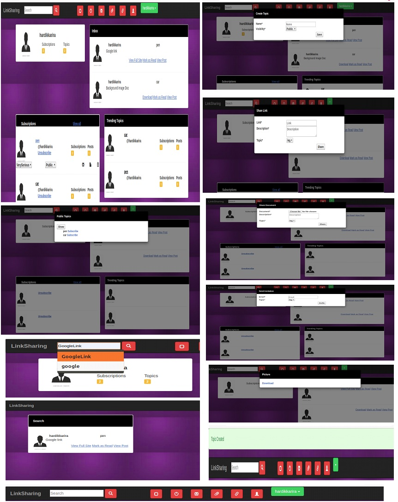
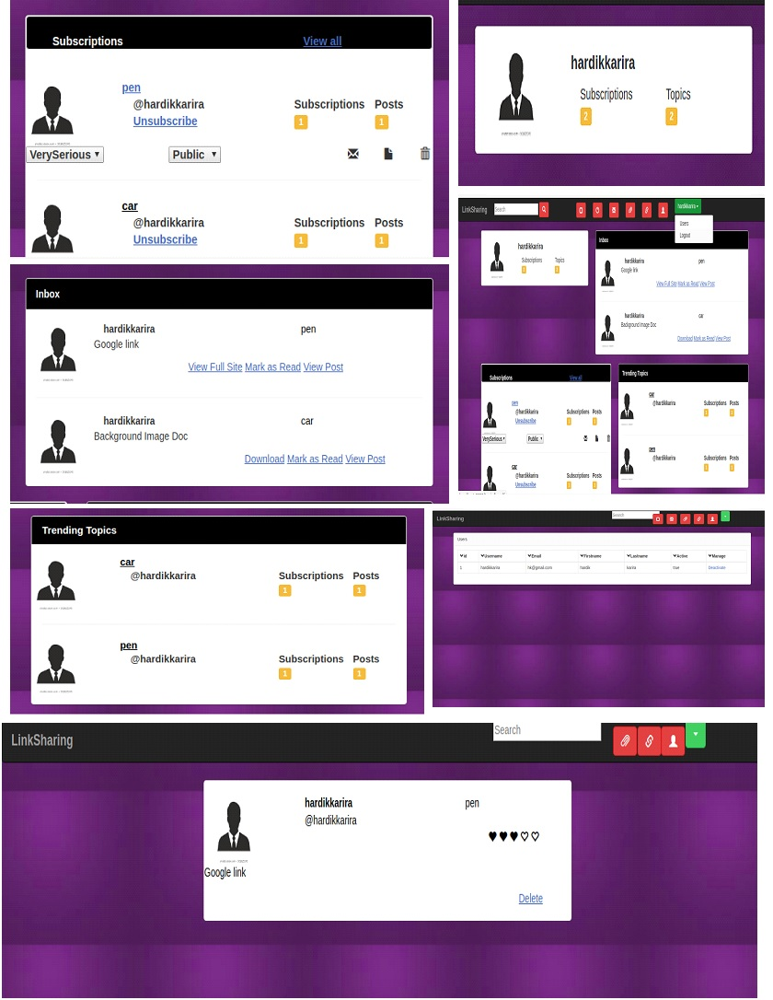

Developed a web application using groovy and grails in which users can share useful documents among subscribers.User can create new topic and share resources for that topic.Also user can provide rating to the resource and mark the resource as read.
Technologies used in the making are Groovy&Grails,Javascript,jQuery,Bootstrap etc..
Other exiciting features like AJAX & Plugins are also been used.

